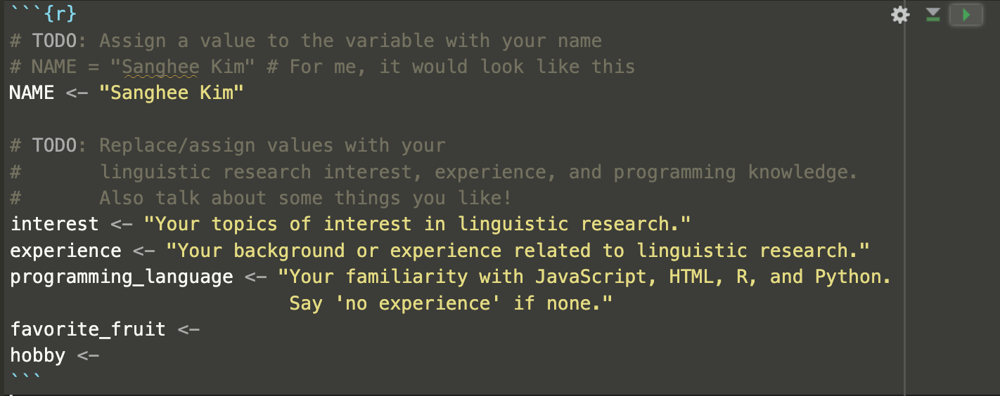
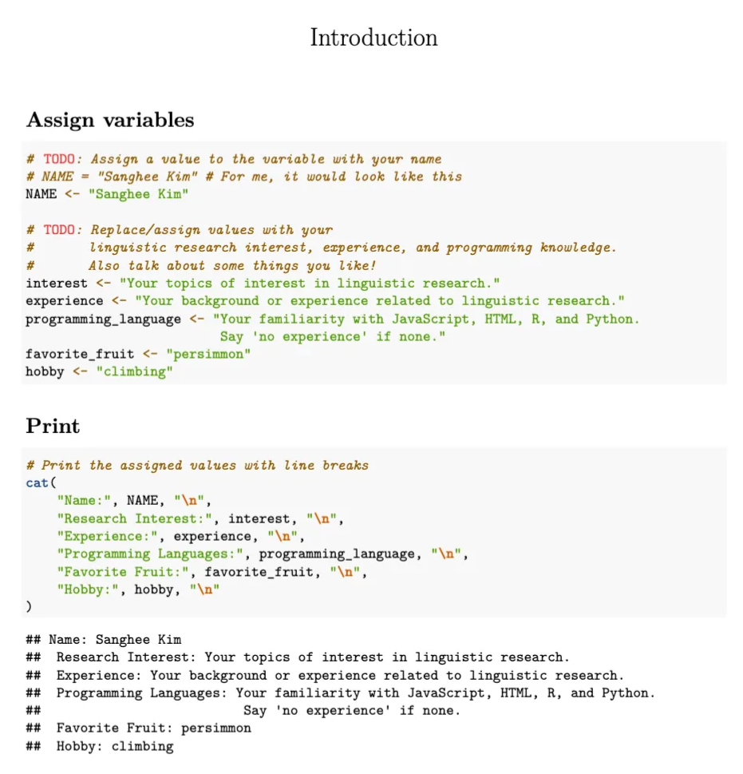

# A1: Tell us about yourself! Using R and Python

---

<aside>


- For this assignment, you will minimally edit some of the already written R and Python scripts and submit the modified files.
- There are two things you should submit:
    1. `introducion.pdf` : a pdf file compiled using R markdown
    2. **URL** to your Google Colab notebook page
- Tip: Search `TODO` to find lines that need to be edited.
</aside>

# Using R

## Install R and R studio

If you don’t have R yet, please go ahead and download R and R studio. R studio allows a neat visual interface with R, so I’d recommend you downloading it.

- Visit [https://posit.co/download/rstudio-desktop/](https://posit.co/download/rstudio-desktop/) and download R and R studio.
- We will use what is called an R markdown. This blog has quick introduction to it: [https://afit-r.github.io/r_markdown](https://afit-r.github.io/r_markdown). Each “chunk” always begins with a ````{r}` and end with a `````. As you can see in the blog, you can include different options like ````{r echo=False}` in the beginning of a chunk, depending on what you like. We won't worry about these optional settings for now. But always make sure to begin and end the chunk with those.

## Introduction to R

If you are less familiar with R, see **Part 2** in [https://learningstatisticswithr.com/lsr-0.6.pdf](https://learningstatisticswithr.com/lsr-0.6.pdf)

## Download `introduction.Rmd`

You will work with this file. (You should save it as a text file and change the extension, or you can also download the file directly from Canvas.)

<aside>


[introduction.Rmd](a1_files/introduction.rmd)

</aside>

## Edit file

- If you don’t have R markdown, you can easily download it by entering:
    
    ```r
    install.packages("rmarkdown")
    ```
    
- You will see a guideline inside the R markdown (.Rmd) script. Your task is to assign the variables with your response.
- The first chunk will look like this:
    
    ```r
    # Assign variables
    ```{r}
    # TODO: Assign a value to the variable with your name
    NAME <- "Sanghee Kim"
    
    # TODO: Replace/assign values with your
    #       linguistic research interest, experience, and programming knowledge.
    #       Also talk about some things you like!
    interest <- "Your topics of interest in linguistic research."
    experience <- "Your background or experience related to linguistic research."
    favorite_fruit <- 
    hobby <- 
    ```
    ```
    
    You should replace some variables with your response, and fill in the missing values for the variables (e.g., “favorite_fruit”). 
    
- The second chunk looks like below. There’s nothing you should modify.
    
    ```r
    # Print the assigned values with line breaks
    print(
        f"Name: {NAME}\n"
        f"Research Interest: {interest}\n"
        f"Experience: {experience}\n"
        f"Programming Languages: {programming_language}\n"
        f"Favorite Fruit: {favorite_fruit}\n"
        f"Hobby: {hobby}"
    )
    ```
    

## **Run chunk**

- Once you edited the chunk, you can see if you can run the chunk. See the little green arrow (▶️) on the top right corner of the screenshot below? Click that to run chunk. Again, make sure that each chunk begins with a ````{r}` and end with a ````` , as you can see below.
    
    
    
- Run the second chunk as well, as check if you see the printed output, as you can see below. If you do without any error messages, hurray, you did it!
    
    
    
- Go to **File > Save.**

## Save output as PDF

- Once you checked everything works fine, i.e., no error messages and you entered all your information, you will “knit” this markdown file as PDF.
- On the top of your screen, you will see a 🧶 (in blue) “Knit” icon. Click on the tiny arrow (🔽). You will then see multiple options. Click on “Knit to PDF.”


- Once you do this, you should see a PDF file with the same name as your .Rmd you were working on. That output will look like below.
    
    
    

**This is the one of the two files you should submit.**

# Using Python

## Introduction to Python

If you’re new to Python, see **Section 3** in [https://docs.python.org/3/tutorial/](https://docs.python.org/3/tutorial/) (other sections such as Sections 4, 5, and 7 will be relevant later).

## Google Colab

We will use Google Colab to work with code written in Python. You don’t need to download anything software.

## Download `introduction.ipynb`

You will work with this file. (You should save it as a text file and change the extension, or you can also download the file directly from Canvas.)

<aside>


[introduction.ipynb](a1_files/introduction.ipynb)

</aside>

## Upload file to Google Colab

1. First, go to https://colab.research.google.com/ ([https://colab.research.google.com/](https://colab.research.google.com/)) (You should log into your google account).
2. Click “New Notebook”
3. Go to File > Upload notebook
    
    
    
4. Upload the downloaded `introduction.ipynb` to your current notebook.
    
    Once the notebook file is successfully uploaded, your page will look like below.
    
    
    

## Edit file

Now, edit the file as you did with the R markdown file. You should re-assign all the variables with new values.

## Run cell

- If you hover over your mouse cursor around top left corner of the cell, you will see an arrow (▶️) popping up automatically. Click that to run cell.
    
    
    
- Error! Uh oh, we have an error message. It looks like something is missing. Right, we missed to include the values to the last two variables. (You should also replace the existing values for the top three variables as well.)
    
    
    

## Save notebook

Once all cells run without any errors, go to **File > Save**.

## Share the file

1. On the top right of your window, you will see a “Share” button. Click that, and you will see different share options. **Click “Anyone with the link”.**
    
    
    
2. Then change the role to **“Commentator”.**
    
    
    
3. Then click **“Copy link”** below. **The link you have is what you should submit.**
    
    
    

# Submission

Go to Assignment submission page. Upload:

<aside>


1. The pdf file generated with using R markdown (`introduction.pdf`).
2. URL copied from your Google Colab notebook — make sure this is the edited version and it runs without any error messages.
</aside>