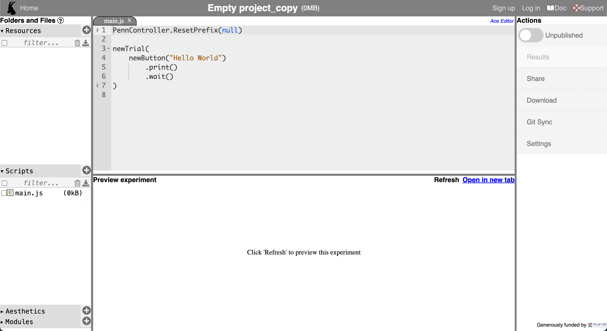

# A2: Lexical decision task

<aside>


We discussed lexical access, and how a lexical decision task can be a useful method for understanding lexical access. 

This assignment covers 1) **material creation** and 2) **experimental setup.** 

For 2), you will set up an experiment for a lexical decision task (which targets semantic and phonological priming effects) using PCIbex.

For 1), you will manually create new experimental materials.

</aside>

---

# Experimental material

<aside>


[material-worksheet.csv](a2_files/material-worksheet.csv)

This .csv file is a worksheet (hence some of the rows are missing) that contains experimental design and materials for the lexical decision task.

</aside>

# PCIbex

## Create an account on PCIbex

Go to [https://farm.pcibex.net/](https://farm.pcibex.net/) then sign up.

## Start a new project

Click *Empty Project,* then you will see a page like this below. You can rename the project (e.g., lexical decision task).



# Experiment setup

<aside>


[pcibex-1.zip](a2_files/pcibex-1.zip)

This file contains files used for setting up the a lexical decision task on PCIbex.

</aside>

Download and unzip the file. Go to the `data_includes` folder, and you will find `main.js` in it. 

For editing this javascript file, you can i) either use the PCIbex editor, or ii) use a text editor to work on the file. I personally use a text editor (called Visual Studio Code) since it tells me missing brackets or dots that are crucial for running the code. PCIbex editor is sometimes a bit slow in updating changes, so if you’re using the PCIbex’s built-in editor, make sure all the changes you have made are saved before leaving the page or running the experiment.

<aside>

For the Ibex Farm document, see:

[https://github.com/addrummond/ibex/blob/master/docs/manual.md](https://github.com/addrummond/ibex/blob/master/docs/manual.md)

</aside>

# Task

<aside>


1. Create missing competitor/target words,
2. Edit the `main.js` file,
3. Check if the experiment runs,
4. Include a short reflection on the assignment as a comment in the .js file
5. Submit the project URL to the Assignment page.
</aside>

## 1. Creating missing competitors

In the .csv file you downloaded, you’ll see that critical items from 11 to 15, and filler items from 26 to 30 are missing.

**Critical items: Create competitor words**

- The target words for critical items 11 to 15 are: ***shirt, steel, train, spice, spear***
- You should create new words for each of the three condition.
- For example, for a target word ***shark**,* the three words will be:
    - [semantic overlap condition] Target: **SHARK**; Competitor: **WHALE**
    - [phonological overlap condition] Target: **SHARK**; Competitor: **SHARP**
    - [unrelated condition] Target: **SHARK**; Competitor: **BUTTER**
- Do the same for the 5 target words above.

**Filler items: Create target words**

- The competitor words for filler items 26 - 30 are: ***cycle, stairs, handle, left, reach***
- For filler items, there is only one condition.
- You should create a nonword, a word that is not real English. For example, for a competitor word ***cat**,* the target word will be: **THAFE**
- Do the same for the 5 competitor words above.

<aside>


1. Make sure that the words you newly created are NOT already used in the material.
2. You’re making competitor words for critical items, and target words for filler items.
</aside>

## 2. Fill in the missing lines in `main.js`

There are primarily three tasks. You can find these task by searching ‘**TODO**’ in the file.

<aside>

1. Create **three practice trials**, **critical trials** and **filler trials**. These trials should be based on the .csv material file you downloaded, and your newly created items.
2. Include the **practice trial in the sequence**.
3. Change the lag time between the competitor word and the target word to **1000**.
4. (optional) You can also change the competitor and target words to be all capitalized (e.g., SHARK instead of shark).
</aside>

Now that you created the competitor words, you will use those to fill in the missing lines in the `main.js` file. When you do this, you must **follow the same syntax and naming convention** in the given `main.js` file. 

- For example, for critical items, the (a) semantic (”sem”), (b) phonological (”phn”), and (c) unrelated (”unr”) conditions for item #11 should be labeled as below. Do the same for the rest of the critical items. Notice that **the right-hand side number doesn’t change for the same item**. The identifier for the sequence should look like this (this is not a complete line).
    
    ```jsx
    ["critical_phn", 11] // for the semantic condition (item #11)
    ["critical_sem", 11] // for the phonological condition (item #11)
    ["critical_unr", 11] // for the unrelated condition (item #11)
    ```
    
- For filler items, the identifier for the sequence should look like this (this is not a complete line).
    
    ```jsx
    ["filler", 16] // for the filler item (item #16)
    ```
    

<aside>


1. Javascript is sensitive to punctuations, such as semicolon (;) and comma (,). I left notes where you should or should not include commas — so make sure you have followed the correct syntax.
2. If you see errors, also check if you have the right bracketing, e.g., If you started with two {{, then that line should end with }}.
</aside>

## 3. Check if the experiment runs

### Upload file to your PCIbex Project

1. If you were using a text editor:
    
    Now switch back to your PCIbex project page. Find the “Scripts” panel on the bottom left of the page. You will see that there is already an empty file included by default. 
    
    Drag and drop your new `main.js` file under the “Scripts” panel. Once you try to upload the new javascript file, you will see a pop-up message like below. Click “Overwrite selected files.”
    


1. If you were working directly using the editor on PCIbex:
    
    There’s nothing to upload. But sometimes PCIbex is a bit slow with updates, so make sure all the changes you have made are saved.
    

### Preview your experiment

Now that you have a new `main.js` file, let’s check if this works! Click “Open in new tab” in the Preview experiment section, which you can see on the bottom panel of your project page.


## 4. Include your reflection

Now that you have set up an experiment for a lexical decision task, what are other modifications you would want to make as a researcher? What other components can we include in this experiment? **Type in a few sentences as a comment in the `main.js` file that you uploaded.**

You should check if the experiment still runs well, even after including your comment.

## 5. Submit your assignment

Now that you checked the script works, you will **share the link to your project.**

On the right panel of your project page, you will see “Actions” panel. Click on “Share.”


A pop-up box will show up, and you see a link under **Demonstration link**. 


The final step:

<aside>


**Copy and paste your Demonstration link to the Assignment submission page.**

</aside>