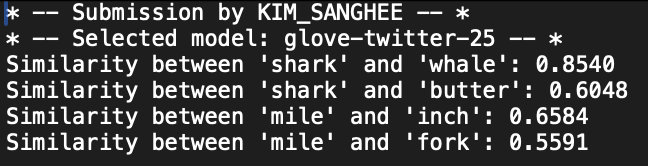

# A3: Word similarity

---

# Task overview

Here are the tasks for this assignment:

<aside>

1. Calculate similarity scores for the materials you created for Assignment 2. This code should print and save `similarity-scores.txt`.
2. By using similarity scores, get words that are semantically (un)related to the target words. This code should print and save `unRelatedWords.txt`.
3. Update your PCIbex experiment by (i) replacing your old *sem* and *unr* condition words with new words that you obtained in Task 2, and (ii) changing the experimental setup. See guidelines below.
</aside>

# Calculating similarity scores and generating words

<aside>

Use `get_simScoreWords.ipynb` for Task 1 and Task 2.

- Either download the jupyter notebook file
    
    [get_simScoreWords.ipynb](a3_files/get_simScoreWords.ipynb)
    
- Or make a copy of this file
    
    [Google Colab](https://colab.research.google.com/drive/17vfq4_gh2qOEeXnosIjWGyrBftjAiIt6?usp=sharing)
    
</aside>

## Task 1

**Calculate similarity scores** for the materials you created for Assignment 2. This code should **print and save** `similarity-scores.txt`. Do the cosine similarity score comparison only for the semantically related and unrelated words. Don't worry about the phonologically related words.

<aside>

**The output .txt file should look something like this (but with more lines).**

</aside>

## Task 2

By using similarity scores, **get words that are semantically (un)related to the target words**. This code should **print and save** `unRelatedWords.txt`. Don't worry about the phonologically related words.

<aside>

**The output .txt file should look something like this (but with more lines).**

</aside>

# Editing PCIbex setup

## Task 3

1. **Update your PCIbex lexical decision task experiment** by using the new materials you created in Task 2. Replace your old *sem* and *unr* conditioned words with new words, using the word list in `unRelatedWords.txt`. For example, given the output I have in Task 2, I will use *deer* as my competitor word for the target word, *shark*. I chose this word because the two have the same number of syllables and start with a different sound.

2. **Replicate part of the setup** in Experiment 1 in Plaut & Booth (2000).

<aside>

[Plaut_Booth-2000.pdf](a3_files/Plaut_Booth-2000.pdf)

Plaut, D. C., & Booth, J. R. (2000). Individual and developmental differences in semantic priming: empirical and computational support for a single-mechanism account of lexical processing. *Psychological review*, *107*(4), 786.

</aside>

Specifically, see the second two paragraphs under *Materials and Design* section (p. 9):

> **Targets were presented at an 800 ms SOA with a 200 ms inter-stimulus interval (ISI)**. The three conditions for the critical prime-target pairs were counterbalanced between-subjects. Specifically, a related prime, a nonword prime, and an unrelated prime preceded the same target word equally often across three different experimental lists. Because three counterbalancing lists were used, the same stimulus item was never seen by a single object on more than one occasion. Within each list, the order of item presentation was randomized within-subjects.
> 
- Luckily, Ibex automatically takes care of “counterbalancing” described above. It’s done so by `rshuffle` and the `[critical_sem, 1]` style syntax we used in our Assignment 2!

For this, your tasks are to:

1. **Change the setup so that “Targets [are] presented at an 800 ms SOA with a 200 ms inter-stimulus interval (ISI).”**
    - Click the toggle to check out some new/change in terminology.
        
        <aside>
        
        **Prime** word — this is what we referred to as the “competitor” in Assignment 2.
        
        **SOA** (*stimulus onset asynchrony*) and **ISI** (inter-stimulus interval)
        
        - **SOA**: The interval between the onset (i.e., beginning of the presentation) of stimulus 1 and stimus
        - **ISI**: The time betwen stimulus — we referred to as “lag” in Assignment 2.
        
        
        
        
        
        </aside>
        
2. Make the experiment so that it **moves onto the next trial when a participant takes longer than 2000 ms to answer the question**. See https://github.com/addrummond/ibex/blob/master/docs/manual.md to see possible options you can change in the Controller.

# Submission

You will submit two URLs for this assignment:

<aside>

1. URL to your Google Colab. Check the [instruction in Assignment 1](https://www.notion.so/A1-Tell-us-about-yourself-Using-R-and-Python-1bd9f96e057f80609b34f52282e615b7?pvs=21) to save the file and share the link.
2. URL to your PCIbex project. Check the [instruction in Assignment 2](https://www.notion.so/A2-Lexical-decision-task-1bd9f96e057f80699859f585104905c3?pvs=21) to share the Demonstration link.
</aside>